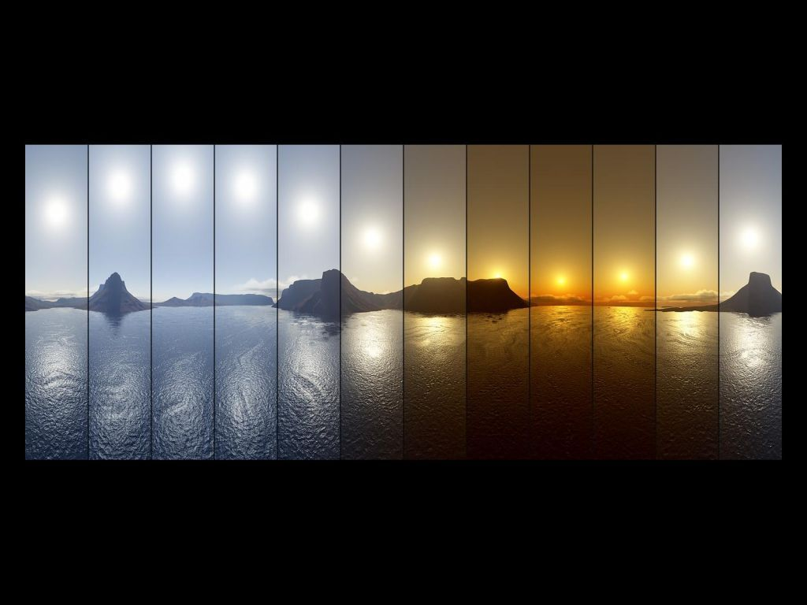
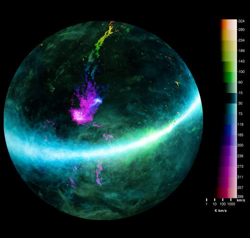

一、如何根据一天中太阳高度角的变化确定地理纬度
----------------------------------------------

试根据图中太阳高度角的信息推断拍摄地点的地理纬度。

二、为什么月食只在月圆时发生？
------------------------------

月食和月相变化有什么关系？ 为什么不是每个月发生一次月食？ 会不会发生“月环食”？

三、为什么可以把月亮拍得很“大”
------------------------------

在一些照片中月亮感觉起来比我们通常所见大得多，为什么？（以下图片来自网络）

四、为什么春分和秋分前后昼夜长短变化最快？
------------------------------------------

试用简单定性的方法说明这个问题。这个问题有什么漏洞？在什么情况下没有意义？

五、从地球上看，金星亮还是木星亮？ 
----------------------------------

简单估算一下，从地球上看，金星亮还是木星亮？

提示：
木星距太阳778,330,000 千米(5.203 天文单位)，直径142,984 千米
金星距太阳108,942,109千米（0.728,231,28天文单位），直径12,103.6千米

六、北京时间18:00太阳在何方？ 
-----------------------------

在北京，太阳在北京时间18:00时在什么方向？是否和日期有关？为什么？

七、金星和木星连线为什么会旋转大约90度？ 
----------------------------------------

本月（2012年3月）中旬左右，木星和金星靠得很近，在天黑时出现在西边，连线大约平行于地平线，金星在右，木星在左。最近几天，金星和木星的连线变为 大致和地平面垂直，金星在上，木星在下。请问为什么两颗行星的连线会旋转大约90度？两颗行星相距最近的时候对应什么情况？

（提示：金星的公转轨道平面和木星的公转轨道平面不完全平行。）

八、某行星上一昼夜有多长？
-------------------------

假设某颗绕太阳转动的行星，自转周期是A，公转周期是B，请问，此行星上一昼夜有多长？如何定义自转？自转周期和一昼夜有什么区别？

九、利用日晷能否测定地理纬度？
-----------------------------

使用日晷能否测量地理纬度？除了日晷，还需要什么工具？ 

十、定性说明太阳高度的变化
--------------------------

试定性说明为什么太阳高度在早晨变化最快，在正午时变化最慢？

十一、为什么日晷背面也有刻度？
-----------------------------

请问为什么日晷两面都有刻度？背面的刻度什么时候有用？第二幅图中的简易日晷在冬天能用么？

十二、日晷能用来确定日期么？
-----------------------------

试考虑，对日晷作什么样的简单改造可以用于确定日期？怎么做精度更高？ 

十三、赤道附近的望远镜有什么优势？
---------------------------------

相比高纬度的望远镜，赤道附近的望远镜有什么优势？

十四、金星凌日前后几天傍晚时金星位置为何？
-----------------------------------------

金星凌日前后几天傍晚时，金星在何方向，高度为何？

十五、大致估计天线的波束形状
----------------------------

定性分析图中天线的波束形状。

十六、如何实现二维颜色棒？
--------------------------

图中是[GASS巡天](http://www.atnf.csiro.au/research/GASS/)得到的中性氢分布图，由于巧妙安排，一幅图同时表示出了柱密度的等效量以及气体速度。请问，如何实现图中的二维颜色棒？

十七、日出前后月球在正南，月相为何？ 
-----------------------------------

如果日出前后月球在正南方，月相为何？ 

十八、人类至少发射过多少个金星探测器？
-------------------------------------

金星探测器成功率为56%，人类至少发射过多少个金星探测器？（提示：如果只发射了两个的话，那么成功率只能是0%，50%和100%，所以可以大概推测出探测器数量的下限。）

十九、简单说明尘埃柱密度近似正比于消光星等 
-----------------------------------------

简单说明为什么尘埃柱密度近似正比于消光星等。

二十、阐述金斯尺度和邦迪半径的区别和联系
-----------------------------------------

金斯尺度定义为

$$ \lambda_J\equiv \frac{c_s}{\sqrt{G\rho}} $$

邦迪半径定义为

$$ r_{\rm Bondi}=\frac{GM}{c_s^2} $$

思考：声速 \\(c_s\\) 的含义为何？

二十一、如何理解一堆小天体的邦迪吸积率？
-----------------------------------------

邦迪吸积率为
$$\dot{M}=\frac{4\pi\rho G^2 M^2}{c_s^3}$$
描述的是一个质量为M的天体球对称吸积时的吸积率。

考虑质量相等，总质量为M的n个天体的总吸积率，可以发现
$$\dot{M}_{tot}=\frac{1}{n}\frac{4\pi\rho G^2 M^2}{c_s^3}$$
只是把\\(n\\)个天体看做一个整体时的\\(1/n\\)，试解释这一点。并思考这一点对恒星形成的重要性。

二十二、如何用邦迪吸积说明星系必有外流？
-----------------------------------------

假设星系质量为\\(10^{11} M_{\odot}\\)，星系际介质平均密度为\\(10^{-3}\\) H/cm\\(^3\\)，星系平均距离1 Mpc。估计星系的邦迪吸积率和星系际介质总质量。试说明星系（在某个时期）必有外流。

二十三、如何通过分子柱密度和临界密度限制分子云厚度？ 
---------------------------------------------------

如果测得了分子的柱密度，能否结合其临界密度限制分子云厚度？

二十四、说明分子云是分形结构的
------------------------------

通过分子云典型参数说明分子云是分形结构的。（例如\\(^{13}\\)CO丰度比为\\(1.7\times 10^{-6}\\)，临界密度大约是\\(10^3\\) cm\\(^{-3}\\)，分子云典型柱密度\\(10^{21}\\) cm\\(^{-2}\\)，典型尺度为10 pc。）

二十五、如何说明分子云是薄的？
------------------------------

除了用柱密度除以体密度还有什么办法？

二十六、张角相同的天体亮度是否相同？
-----------------------------------

想象在距离地球很远的地方有一个很大的天体，其张角和满月相同（半度），表面性质也和月球相同。那么从地球上看，其亮度和月球相比是否相同？从太阳的位置看是否相同？

提示：假设太阳周围有覆盖全天的冰，那么不管这些冰在什么位置，它们反射的太阳光是同样多的，从太阳的位置上看，其亮度和距离无关。

二十七、如何估算奥尔特云中冰块的面填充因子上限？ 
-----------------------------------------------

由于已知夜空是黑的，所以奥尔特云中冰块的总和不可能覆盖很大天区（面填充因子小）。试估算这个面填充因子的上限。这个上限是否小于满月的填充因子？

二十八、如果地球是黑体，其温度是多少？
--------------------------------------

假定地球是黑体，且内部热传导有效，那么地球的温度是多少？如何快速估计这个温度的量级？

二十九、射电望远镜是不是越大越好？
----------------------------------

射电望远镜是不是越大越好？试以太阳射电观测和SZ效应观测为例分析。

三十、把真实放在一起是否一定为真实？
------------------------------------

把真实放在一起是否一定为真实？

提示：思考选择效应。

三十一、分子云需要多长时间会发生可观的变化？
-------------------------------------------

试估计距离100 pc的分子云，用14米口径的望远镜进行CO（1-0）观测。多长时间能看到分子云形态上的变化？

三十二、如何将数组中小于某值的元素置零？
----------------------------------------

如何不用判断的方式，直接通过计算将数组中小于某值的元素置零？（提示：取绝对值）

三十三、如何用有限分段的颜色表工具制作各种颜色表？ 
--------------------------------------------------

如何用
[http://colormap.org](http://colormap.org)
这种有限分段的颜色表工具制作各种颜色表？（提示：可以把几个颜色表合起来。）终极解决方案是什么？（提示：直接计算图中像素的RGB值。）

三十四、如何理解加了反射面的探测器的多普勒效应？ 
------------------------------------------------

对于加了反射面、与源的相对运动方向发生变化探测器，其观测到的多普勒频移如何变化？（考虑镜面中的等效源）

三十五、衍射极限是否可以突破？ 
------------------------------

衍射极限是否可以突破？（提示：需要问怎么算突破？需要额外信息，例如：用信噪比换分辨率。）

三十六、为什么湍流能量从大尺度向小尺度转移？ 
-------------------------------------------

为什么湍流能量从大尺度向小尺度转移而不是反过来？（没有提示，我也不知道。）

[gimmick: math]()
