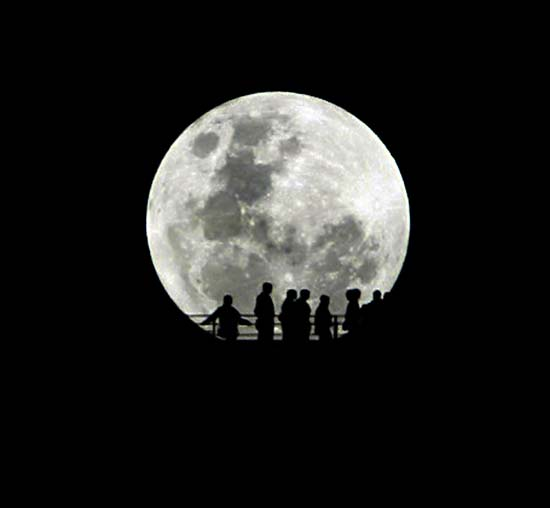

一、如何根据一天中太阳高度角的变化确定地理纬度
----------------------------------------------

试根据图中太阳高度角的信息推断拍摄地点的地理纬度。

二、为什么月食只在月圆时发生？
------------------------------

月食和月相变化有什么关系？ 为什么不是每个月发生一次月食？ 会不会发生“月环食”？

三、为什么可以把月亮拍得很“大”
------------------------------

在一些照片中月亮感觉起来比我们通常所见大得多，为什么？（以下图片来自网络）

